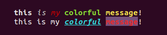

# **Console color**

Simple script for colorize nodejs console messages.

### Install

    npm i node-con-color

### Usage

It's simple to use this function. Put in the brackets your text and specify style as index with grid simbol before.

    '#index{user text here}'

Here index means a number of styles object in config array.
You can specify your own config or use default.  
If you want to use only first style in config, then type grid symbol without a number.

    '#{apply first style}'

### Default styles

| index | color  | style    | background |
|-------|:-------|----------|------------|
| 0     | white  | **bold** | -          |
| 1     | white  | *italic* | -          |
| 2     | red    | normal   | -          |
| 3     | red    | **bold** | -          |
| 4     | red    | *italic* | -          |
| 5     | green  | normal   | -          |
| 6     | green  | **bold** | -          |
| 7     | green  | *italic* | -          |
| 8     | blue   | normal   | -          |
| 9     | blue   | **bold** | -          |
| 10    | blue   | *italic* | -          |
| 11    | yellow | normal   | -          |
| 12    | yellow | **bold** | -          |
| 13    | yellow | italic*  | -          |

If you want other background or combine several styles, for example 'bold' with 'italic', then use your custom styles, where define styles as array.

### Available styles

**colors**: black, red, green, yellow, blue, magenta, cyan, white, grey  
**styles**: normal, bold, italic, underline, inversed, hidden  
**backgrounds**: none, black, red, green, yellow, blue, magenta, cyan, white

### Example

```js
const log = require('node-con-color');

/* default styles */
log('#{this} #1{is} #4{my} #6{colorful} #12{message}!');

/* user styles */
const styles = [
    {
        color: 'cyan',
        style: ['bold', 'italic', 'underline']
    },
    {
        color: 'red',
        style: 'bold',
        back: 'magenta'
    }
];

log('this is my #0{colorful} #1{message}!', styles);
```



-------------
Thanks for using.  
Developed by Ustinov Maxim - [ewclide][1]

[1]: https://vk.com/ewclide  "ewclide"